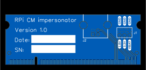
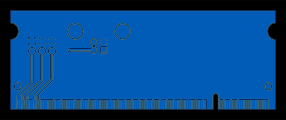

# RPi CM Impersonator

A board the same size and shape as a RPi Compute Module, which can be inserted into baseboard in place of a RPi CM. Intended to help test baseboards.

TODO: Add photo

## Licence

Copyright © 2023 Phil Baldwin

This work is licensed under a Creative Commons Attribution-ShareAlike 4.0 International License.

You should have received a copy of the license along with this work. If not, see <http://creativecommons.org/licenses/by-sa/4.0/>.
